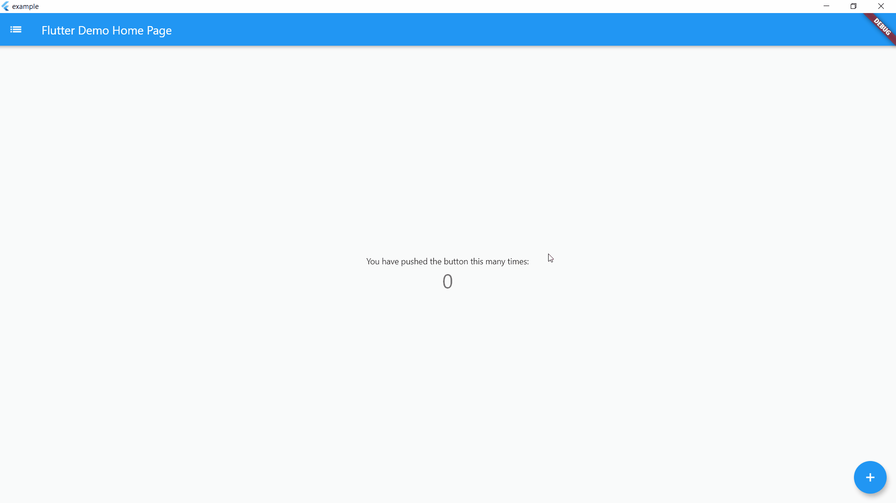

# Flutter Keyboard Shortcuts

Keyboard shortcuts to add where you want



## Example

On controlLeft + key P are pressed, user navigate to SecondPage()
helpLabel will be display on help menu
```dart
    KeyBoardShortcuts(
        keysToPress: {LogicalKeyboardKey.controlLeft, LogicalKeyboardKey.keyP},
        onKeysPressed: () => Navigator.push(
          context,
          MaterialPageRoute(builder: (context) => SecondPage()),
        ),
        helpLabel: "Go to Second Page",
        child: Center(
          child: Column(
            mainAxisAlignment: MainAxisAlignment.center,
            children: <Widget>[
              Text(
                'You have pushed the button this many times:',
              ),
              Text(
                '$_counter',
                style: Theme.of(context).textTheme.headline4,
              ),
            ],
          ),
        ),
      ),
```

If globalShortcuts is set to true, user can use Home Button to go on Homepage, up and down button to go on top or bottom of the page and escape to go on last page
```dart
    KeyBoardShortcuts(
        globalShortcuts: true,
        child: Center(
          child: Column(
            mainAxisAlignment: MainAxisAlignment.center,
            children: <Widget>[
              Text(
                'You have pushed the button this many times:',
              ),
              Text(
                '$_counter',
                style: Theme.of(context).textTheme.headline4,
              ),
            ],
          ),
        ),
      ),
```


initShortCuts() is used to customize shortcuts, you can set home page, title of help menu, icon on custom shortcuts and custom help menu
```dart
    initShortCuts(HomePage(), helpTitle : "Help Menu", helpIcon : Icons.menu);
```

You can also use initShortCuts to create your own global shortcuts, they will be allow in all page were globalShortcuts is true without rewriting these shortcuts
```dart
  initShortCuts(
    HomePage(),
    keysToPress: {
      {LogicalKeyboardKey.controlLeft, LogicalKeyboardKey.keyP},
    },
    onKeysPressed: {() => print("Work")},
    helpLabel: {"Print Work"},
  );
```
